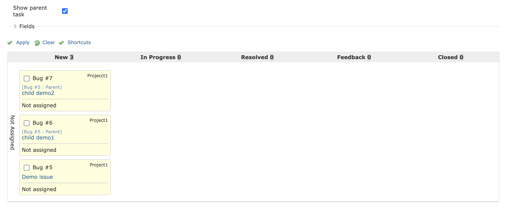

# Redmine kanban plugin
This plugin provides the Kanban board.

## What's new
* Support to Redmine 6.x and timetracking additions [#60](https://github.com/happy-se-life/kanban/pull/60) (Special thanks to @Filippo)

## Features
* Issues can be displayed in a card form by status.
* You can change the issue status and assignee by dragging and dropping.
* You can view all issues by a group or project members.
* You can display some notes of a issue by mouse-over and write the note easily.
* There are many filters for display.
* Warning can be displayed if the WIP limit is exceeded.
* Supports English, German, Spanish, French, Polish, Russian, European Portuguese and Japanese language.

## Screenshots

### Overview

### Ticket filters

### Small card view
You can display more cards than normal size cards at once.  

### Show parent task in issues cards
It is possible to show\hide the issue parent from the filter section.  

## Keyboard Shortcuts
- o : Show login user only.
- e : Show everyone in the project.
- d+u : Due date set to unspecified.
- d+o : Due date set to overdue.
- d+t : Due date set to today.
- d+w : Due date set to this week.
- n : Show by normal size card with days left.
- k : Show by normal size card with estimated hours.
- p : Show by normal size card with spent hours.
- s : Show by small size card.
- l : Select all open issues.
- h : Show this help.

## Required Redmine version
* 3.4.6.stable ~ 6.0.2.stable

## Install

1. Move to plugins folder.
<pre>
git clone https://github.com/happy-se-life/kanban.git
</pre>

2. Edit models/constants.rb for your environment.

3. Restart redmine.

4. Enable role permission to each users groups

5. Enable modules for each project.

## Uninstall

1. Move to plugins folder.

2. Remove plugins folder.
<pre>
rm -rf kanban
</pre>

3. Restart redmine.

## Notes
* It has only been used by small organizations upto 30 members before.
* Therefore, the visibility authority is loosely implemented.
* However, I think it is a trade-off with ease of use.

## License
* MIT Lisense

## Thanks for the great contributors who helped with the localization
* @aivorra for Spanish
* @camlafit for French
* @karnow98 for Polish
* @deryaba for Russian
* @HMT-HRO-MaMe for German
* @guilhermelinhares for European Portuguese
* @Wrightie for Italian

## Thanks for the great library
* [mkoryak/floatThead](https://github.com/mkoryak/floatThead)
* [jaywcjlove/hotkeys](https://github.com/jaywcjlove/hotkeys)

## Contact me
* If you have any questions or ideas for improvement, please register with issue.