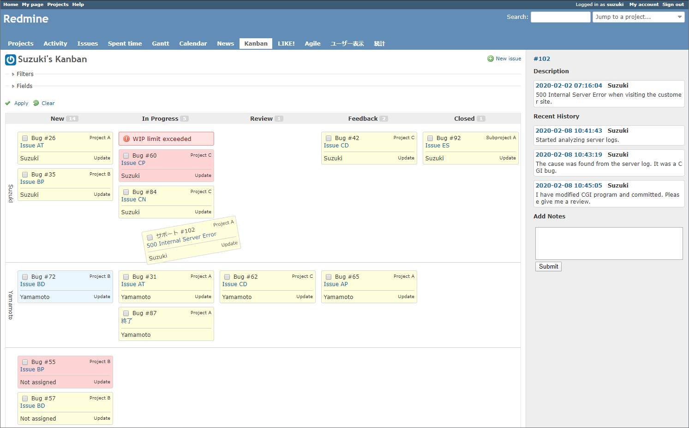
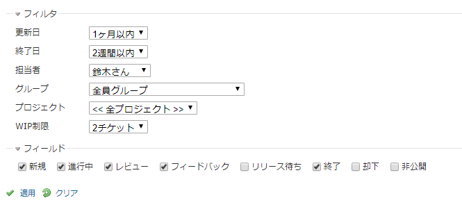
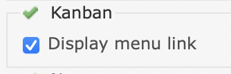

# Redmine kanban plugin
This plugin provides the Kanban board.

## What's new
* Display the remaining days until the due date.
* Filter "updated" and "closed" options can be selected "unspecified".
* Filter "due date" was added.
* Fixed bug of Filter "version".

## Features
* Tickets can be displayed in a card form by status.
* You can change the ticket status and assignee by dragging and dropping.
* You can view all tickets by group or user.
* You can display the note of the ticket by mouse-over and write the note easily.
* There are many filters for display.
* A warning can be displayed if the WIP limit is exceeded.
* Supports English and Japanese language.

## Screenshots

### Overview

### Ticket filters

## Install

1. Move to plugins folder.
<pre>
git clone https://github.com/happy-se-life/kanban.git
</pre>

2. Edit models/constants.rb for your environment.

3. Restart redmine.

4. Enable role permission to each users groups

5. Enable modules for each project.

## Uninstall

1. Move to plugins folder.

2. Remove plugins folder.
<pre>
rm -rf kanban
</pre>

3. Restart redmine.

## Please note
* It has only been used by small organizations before.

## License
* MIT Lisense

## Library used
* [jquery.floatThead](https://github.com/mkoryak/floatThead)
