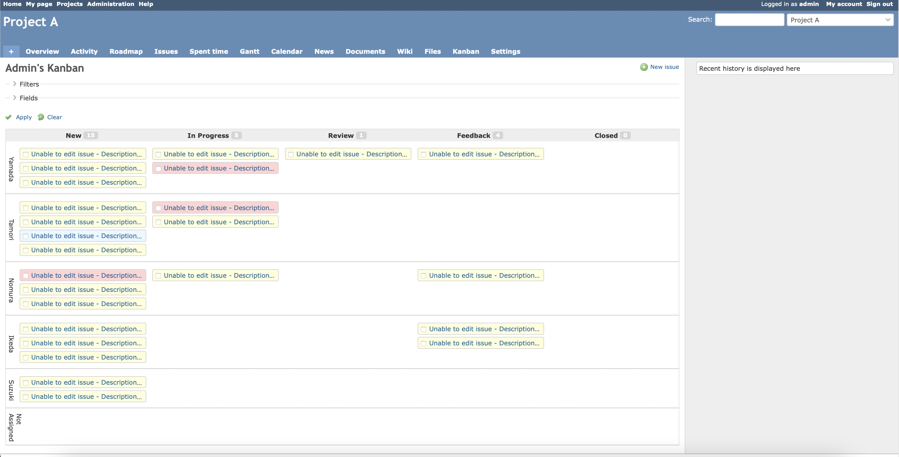

# Redmine kanban plugin
This plugin provides the Kanban board.

## What's new
* Supported Spanish. #24
* It is now possible to switch between normal card size and small card size. See screenshot.
* It is now possible to use keyboard shortcuts. See below.
* The estimated hours can be displayed on the card. (type 'k' key)

## Features
* Issues can be displayed in a card form by status.
* You can change the issue status and assignee by dragging and dropping.
* You can view all issues by a group or project members.
* You can display some notes of a issue by mouse-over and write the note easily.
* There are many filters for display.
* Warning can be displayed if the WIP limit is exceeded.
* Supports English, Spanish and Japanese language.

## Screenshots

### Overview

### Ticket filters

### Small card view
You can display more cards than normal size cards at once.  

## Keyboard Shortcuts
- o : Show login user only.
- e : Show everyone in the project.
- d+u : Due date set to unspecified.
- d+o : Due date set to overdue.
- d+t : Due date set to today.
- d+w : Due date set to this week.
- n : Show by normal size card with days left.
- k : Show by normal size card with estimated hours.
- s : Show by small size card.
- h : Show this help.

## Install

1. Move to plugins folder.
<pre>
git clone https://github.com/happy-se-life/kanban.git
</pre>

2. Edit models/constants.rb for your environment.

3. Restart redmine.

4. Enable role permission to each users groups

5. Enable modules for each project.

## Uninstall

1. Move to plugins folder.

2. Remove plugins folder.
<pre>
rm -rf kanban
</pre>

3. Restart redmine.

## Notes
* It has only been used by small organizations upto 30 members before.
* Therefore, the visibility authority is loosely implemented.
* However, I think it is a trade-off with ease of use.

## License
* MIT Lisense

## Thanks
* [mkoryak/floatThead](https://github.com/mkoryak/floatThead)
* [jaywcjlove/hotkeys](https://github.com/jaywcjlove/hotkeys)

## Message from me
* I'm an ordinary office worker and a Sunday programmer.
* I like programming, so I'd love to hear your ideas for improvement.
* If you have any questions, please register with Issue.